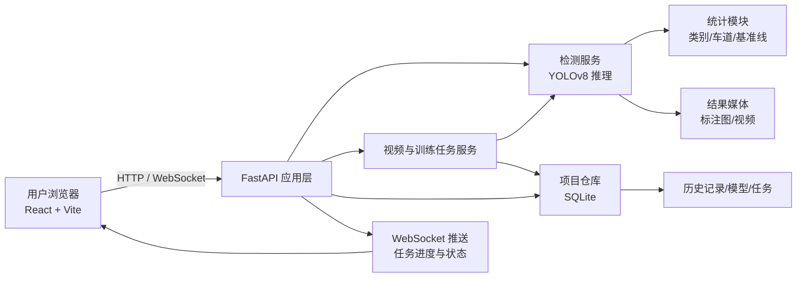
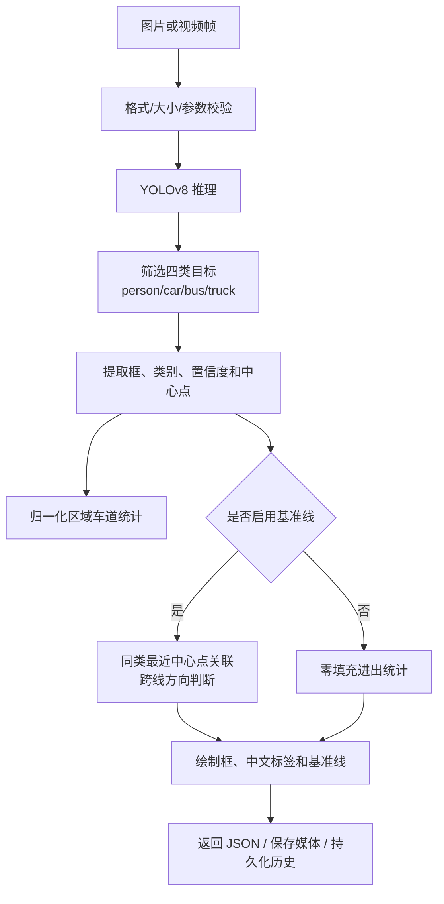

# 毕业论文可直接使用的系统设计材料

> 本文内容按当前项目实际实现和真实实验结果整理。章节编号可按学校模板调整；实验数值来自 `experiments/results/` 下保存的训练与部署基准记录。

## 1. 需求分析

### 1.1 建设目标

本课题面向道路交叉口和城市道路视频场景，设计并实现一个基于深度学习的交通目标检测与任务管理系统。系统以图片和视频为输入，完成行人、汽车、公交车和卡车四类道路目标的识别、分类计数、车道统计、进出基准线统计和结果留存，并通过 Web 界面向使用者展示检测结果、视频任务进度及历史记录。

与仅输出边界框的离线检测程序不同，系统需要形成“输入采集 - 模型推理 - 交通统计 - 任务管理 - 结果追溯”的业务闭环，支持后续的演示、模型替换和工程部署。

### 1.2 功能性需求

| 编号 | 功能 | 需求说明 | 对应实现 |
|---|---|---|---|
| FR-01 | 图像检测 | 上传 JPG、JPEG、PNG 或 BMP 图像，输出目标框、类别、置信度和处理耗时 | `POST /api/detect-vehicles` |
| FR-02 | 分类与车道统计 | 输出 person、car、bus、truck 的数量，并按东南西北四个归一化区域统计车辆 | `IntelligentVehicleDetector` |
| FR-03 | 进出统计 | 可配置水平/垂直基准线、位置和方向，统计跨线目标的 entry/exit 数量 | `BaselineCrossingCounter` |
| FR-04 | 视频任务 | 上传 MP4、AVI、MOV 或 MKV，后台逐帧处理并持续返回进度和最新统计 | `POST /api/detect-video`、WebSocket |
| FR-05 | 历史管理 | 保存图片原图、标注结果、分类数量、模型名和处理时间；支持单条及多选删除 | SQLite + `/api/history` |
| FR-06 | 模型管理 | 查看、上传、激活模型；支持 CPU/CUDA/自动设备选择 | `/api/models`、`/api/inference-device` |
| FR-07 | 实验管理 | 导入 YOLO 数据集，发起训练任务和统一验证集模型对比 | `/api/datasets`、`/api/training/jobs`、`/api/experiments/compare` |
| FR-08 | 异常反馈 | 对不支持格式、超尺寸文件、无效基准线和不可用服务返回明确错误信息 | FastAPI 参数校验与异常处理 |

### 1.3 非功能性需求

系统采用前后端分离架构，前端负责交互和可视化，后端负责推理、任务调度和数据持久化。接口应为 JSON 或 `multipart/form-data`，对图片、视频和模型文件进行扩展名、内容大小及参数范围校验；视频和训练等耗时任务采用后台任务方式避免阻塞页面。实际部署需支持 CUDA 加速、跨域白名单、日志和健康检查。

## 2. 系统总体架构

系统分为四层：

1. 表现层：React 单页应用提供实时检测、图像检测、视频任务、数据管理和检测记录页面。
2. 接口层：FastAPI 提供 REST API、OpenAPI 文档、WebSocket 推送、文件校验和统一异常响应。
3. 业务层：检测服务封装 YOLO 推理与结果绘制；视频服务封装后台逐帧处理；训练服务封装训练和统一验证集对比。
4. 数据层：SQLite 保存数据集、模型、任务和历史记录；`output_images/` 与 `output_videos/` 保存可展示的媒体文件。

## 3. 检测与统计流程

图片任务执行同步推理，结果直接返回。视频任务先创建 `queued` 状态的任务记录，再后台逐帧推理；每处理 10 帧或到达末帧时更新任务进度，并通过 WebSocket 广播。完成后将浏览器兼容的视频、最终分类数量、进出统计和处理时间写入任务及历史记录。

## 4. 关键实现说明

### 4.1 四类道路目标映射与结果标准化

项目基于 COCO 类别编号筛选 person(0)、car(2)、bus(5) 和 truck(7)，避免界面显示与交通业务无关的类别。检测结果被转换为统一对象，至少包含类别、置信度、像素坐标、归一化中心点和车道方向。无目标类别以 0 填充，前端可以稳定地绘制表格和统计图。

### 4.2 车道与交通统计

系统将画面划分为东、南、西、北四个归一化区域，利用目标中心点确定所属区域。行人仅进入类别统计；车辆进入类别统计和车道统计。该方法不依赖固定分辨率，便于在不同尺寸的图片和视频输入中复用。

### 4.3 可配置基准线进出统计

基准线配置由方向、位置和运动方向组成。系统支持水平线的上/下方向及垂直线的左/右方向，位置限制在画面的 5% 至 95%。视频帧中对同类别目标按最近中心点进行轻量关联：关联距离阈值为归一化坐标的 0.14，超过 45 帧未出现的轨迹自动清理。目标从基准线一侧移动到另一侧时，依据设定方向累计为进入或离开。该机制的目标是提供轻量级交通流量统计，不将其表述为多目标跟踪算法的理论创新。

### 4.4 异步视频任务与状态追踪

视频上传接口快速返回任务 ID，耗时的读帧、推理、绘制和转码在后台执行。任务状态包含 `queued`、`running`、`completed` 和 `failed`，状态、进度、信息和结果使用 SQLite 持久化，因此页面刷新后仍可通过任务 ID 查询。WebSocket 额外推送视频进度和完成/失败事件，减少轮询等待。

### 4.5 历史记录及安全删除

每次图片检测可保存原图副本、标注图、类别统计、模型名和处理耗时。删除单条或批量记录时，后端在一个数据库操作中移除所选记录，并仅清理 `output_images/`、`output_videos/` 下与该记录关联的应用生成文件；不删除任意外部路径。该设计使“删除记录”与“删除可展示结果”保持一致。

### 4.6 异常处理与输入校验

图片接口限制为 JPG/JPEG/PNG/BMP 且最大 10 MB；视频接口限制为 MP4/AVI/MOV/MKV 且最大 500 MB；数据集导入限制 ZIP 且最大 1 GB。基准线方向不匹配、位置越界、模型文件不是 `.pt`、任务 ID 不存在和检测服务不可用均返回明确的 4xx/5xx 状态及中文错误信息。前端在任务失败或接口失败时显示可读的错误状态，不把失败伪装为成功结果。

## 5. 实验与结果分析

### 5.1 数据集和实验条件

实验使用 COCO 2017 val2017 构建的四类交通目标子集，随机种子为 42。训练集有 1 500 张图像和 6 906 个实例，验证集有 300 张图像和 1 407 个实例。统一使用 RTX 4050 Laptop GPU、Python 3.12.10、PyTorch 2.11.0+cu128、Ultralytics 8.4.107、输入 640 x 640、batch=8 和 10 个训练轮次。

### 5.2 模型规模对比

| 模型 | Precision | Recall | F1 | mAP50 | mAP50-95 | 验证推理(ms/图) |
|---|---:|---:|---:|---:|---:|---:|
| YOLOv8n | 61.35% | 40.51% | 48.79% | 44.81% | 28.04% | 6.13 |
| YOLOv8s | 47.45% | 45.21% | 46.30% | 44.66% | 27.24% | 8.79 |
| YOLOv8m | 45.04% | 38.99% | 41.80% | 40.30% | 25.12% | 15.91 |

在当前数据量与 10 轮训练条件下，YOLOv8n 的 mAP50-95 最高，推理也最快。该结果表明应把模型规模、数据规模和训练预算一起讨论，不能泛化为“小模型始终优于大模型”。

### 5.3 默认阈值下的部署性能对比

下表来自真实部署基准。固定阈值运行点的 P/R/F1 按 IoU=0.50 的逐图一对一匹配计算；RSS 是独立 Python 工作进程的常驻内存增量，GPU 峰值是模型预热后 PyTorch 报告的最大已分配显存。

| 模型（阈值 0.40） | P | R | F1 | 模型推理(ms/图) | RSS 增量(MiB) | GPU 峰值(MiB) |
|---|---:|---:|---:|---:|---:|---:|
| YOLOv8n | 78.58% | 47.19% | 58.97% | 8.36 | 686.9 | 32.4 |
| YOLOv8s | 81.29% | 45.70% | 58.51% | 8.64 | 730.3 | 78.5 |
| YOLOv8m | 76.73% | 44.99% | 56.72% | 14.99 | 787.3 | 160.5 |

默认阈值下，YOLOv8n 的固定阈值 F1 最高，同时进程内存和显存占用最低，适合作为本系统默认部署模型。YOLOv8s 的 Precision 略高，但没有获得更高的 F1 或 mAP50-95；YOLOv8m 的速度和资源代价明显更高，当前条件下未体现性能优势。

### 5.4 置信度阈值对比

| YOLOv8n 阈值 | P | R | F1 | 模型推理(ms/图) | 端到端(ms/图) |
|---:|---:|---:|---:|---:|---:|
| 0.25 | 64.40% | 55.79% | 59.79% | 8.20 | 14.68 |
| 0.40 | 78.58% | 47.19% | 58.97% | 8.36 | 14.94 |
| 0.55 | 86.26% | 38.38% | 53.12% | 8.20 | 14.54 |

阈值 0.25 在本验证集上取得最高 F1，说明其总体平衡最好；阈值 0.40 以较小的 F1 代价显著提高 Precision，适用于希望减少误报的实时界面默认值；阈值 0.55 虽然 Precision 最高，但 Recall 降至 38.38%，不宜作为默认设置。论文可将 0.40 定位为系统的保守默认阈值，将 0.25 作为高召回统计场景的可选参数。

### 5.5 实验局限性

实验仅训练 10 轮，类别分布存在长尾，公交车和卡车样本不足；训练和验证数据由 COCO val2017 固定重划分，未包含独立外部道路场景测试集；每个模型仅使用一个随机种子。正式答辩应明确这些限制，并把扩充交通场景数据、提高训练轮次、多随机种子重复实验和独立测试集验证作为后续工作。

## 6. 创新点表述

### 6.1 推荐写法

本课题的创新主要体现在面向交通检测业务的系统集成与工程实现，而非提出新的 YOLO 网络结构，具体包括：

1. **面向交通业务的多层统计输出。** 在四类道路目标检测结果基础上，将原始边界框进一步转换为类别统计、车道区域统计和可配置基准线进出统计，为交通流量观察提供结构化结果，而不是仅展示检测框。
2. **可配置的轻量化跨线流量统计机制。** 采用归一化基准线配置和同类目标最近中心点关联，使水平/垂直基准线能够随不同道路画面位置调整，并在视频任务中输出进入与离开数量。
3. **检测、任务和证据链的一体化管理。** 将视频推理设计为可持久化的后台任务，通过 REST 查询和 WebSocket 推送展示任务生命周期；检测历史关联原图、标注结果、模型和统计信息，并支持安全批量删除，形成可追溯的业务闭环。
4. **精度、速度与资源约束下的部署选型。** 通过统一验证集的模型规模、置信度、推理速度、RSS 和 GPU 显存对比，为 YOLOv8n 与默认阈值的选择提供真实数据依据，而不是凭经验选型。

### 6.2 避免的表述

不建议将“使用 YOLOv8”或“调用深度学习模型”称为算法创新；不建议将轻量中心点关联称为“高精度多目标跟踪算法”；不建议在仅有 10 轮、单随机种子实验时声称模型“普遍优于”其他模型。答辩时应强调本课题的贡献是将检测、交通统计、异步任务、结果管理和可复现实验有效组合为完整应用系统。
